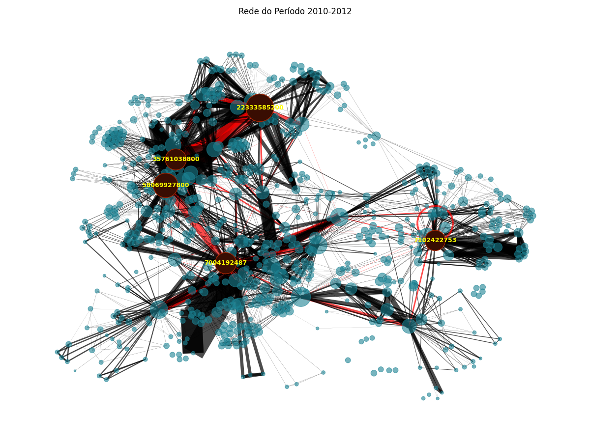
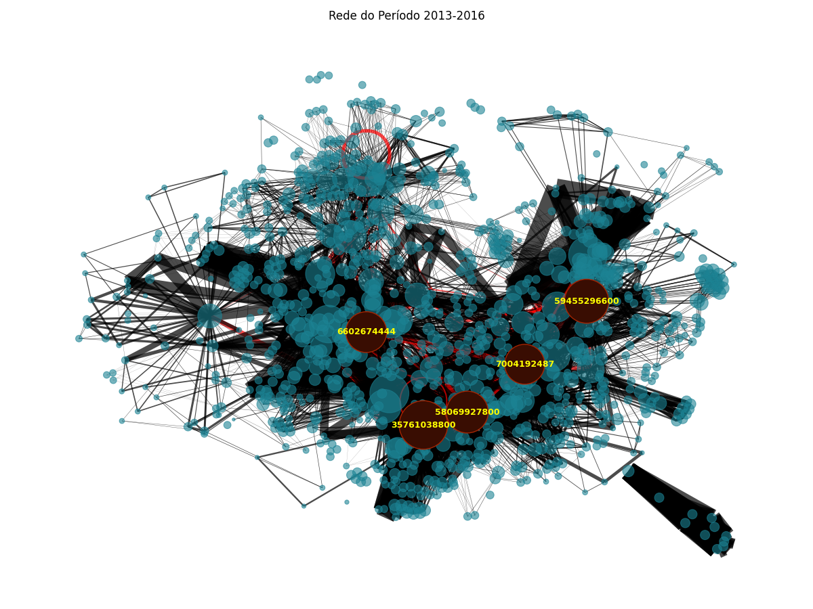
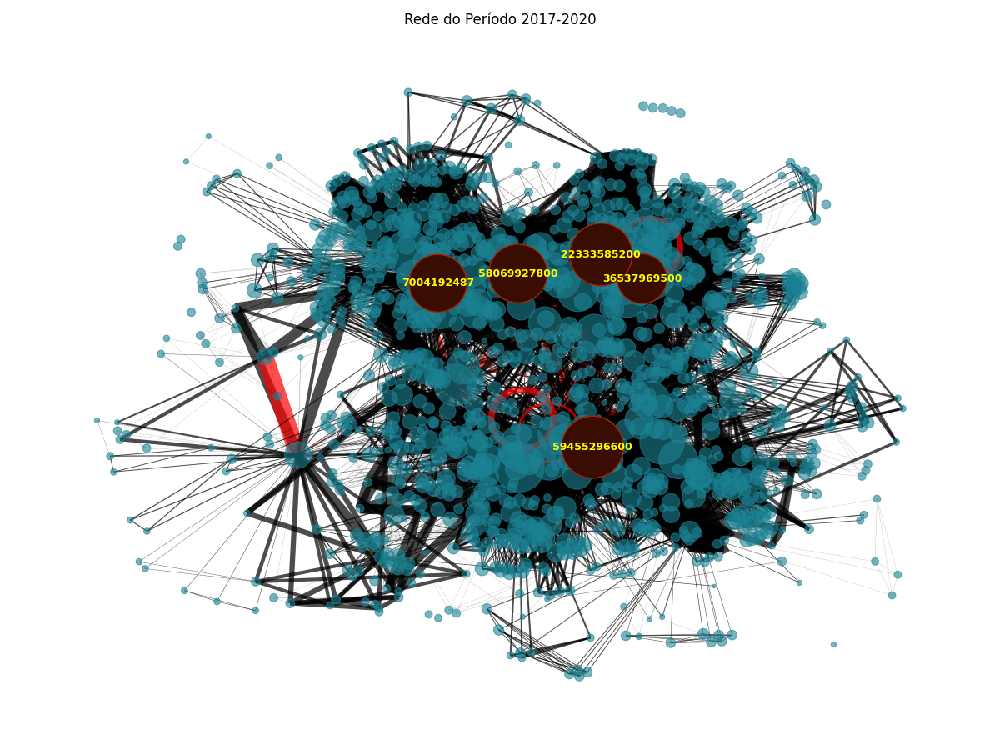
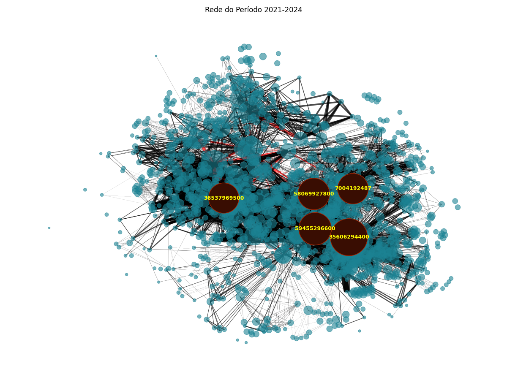

# Análise Temporal de Redes de Coautoria Acadêmica

by  
[André Luiz Lima Souza](https://github.com/andreluizlimaa)  
[Daniel Bruno Trindade da Silva](https://github.com/daniel-trindade)

***

## Visão Geral

Neste projeto, foi realizada uma análise das redes de colaboração científica do Programa de Pós-Graduação em Engenharia Elétrica e de Computação (PPgEEC), abrangendo o período de 2010 a 2025. O estudo examinou a evolução das métricas da rede ao longo do tempo e buscou identificar padrões de colaboração entre pesquisadores acadêmicos.

O principal objetivo foi reforçar os conceitos relacionados a grafos por meio da aplicação prática da biblioteca NetworkX, da linguagem Python. Esta atividade foi desenvolvida no contexto da disciplina de **Algoritmos e Estruturas de Dados II**.

***

## Ferramentas e Bibliotecas Utilizadas

- **Python 3.8+**
- **NetworkX**: Para criação, manipulação e análise de estruturas de rede
- **Pandas**: Para manipulação e análise de dados
- **Matplotlib** e **Seaborn**: Para visualização de dados e gráficos
- **NumPy**: Para operações numéricas

As versões de cada uma delas pode ser encontrada no arquivo requirements.txt.

***

## Análise dos dados

A análise foi dividida em três requisitos principais:

1. Análise temporal de métricas da rede
2. Visualização das redes em períodos específicos de avaliação
3. Análise de sub-grafos e redes ego

vamos explicitar a metodologia de cada um deles isoladamente.

### Requisito 1: Análise Temporal (2010-2025)

#### Metodologia

Para analisar o comportamento temporal da rede do PPgEEC, foi implementado o código R1.py que seguiu as seguintes etapas:

1. Foram carregados os dados da rede para cada ano do período 2010-2025
2. Calculado as métricas solicitadas para cada ano:
   - Densidade da rede - Que mostra o quão colaborativo são os acadêmicos entre si.
   - Número de vértices - Representa o Número de acadêmicos envolvidos;
   - Número de arestas - Número de colaborações entre acadêmicos;
   - Número médio de vizinhos ou Gráu Médio - Quantidade média de colaborações por acadêmico;
   - Distribuição do número de vizinhos - Mostra o quão a rede está dispersa ou se existem hubs (rede centralizada)
3. Foi gerada as visualizações gráficas para cada métrica ao longo do tempo
   - Um gráfico de linhas com os cada uma das métricas expostas no item 2;
   - Um gráfico Ridgeline que mostra a destribuição do número de conexões por pesquisador a cada ano;
4. Foram destacados os marcos importantes de avaliação do PPgEEC (2012, 2016, 2020, 2024)

##### Gráficos:

#### Análise

Através da análise temporal, foi possível observar o seguinte:

1. **Densidade da rede**: A densidade se mantém bastante baixa durante todo o período tendo como valor médio 0.0299 ao longo dos anos. Esse comportamento é esperado em redes de colaboração científica (onde não é comum todos os acadêmicos estarem conectados entre si). Não há grandes variações nesse padão, o que sugere que, mesmo com o aumento no número de nós e arestas, ou seja, acadêmicos e produções, a proporção de conexões possíveis que de fato ocorrem segue estável.

2. **Número de Nós (Acadêmicos)**: Crescimento consistente até 2019, indicando aumento de participantes na rede. Pequena estabilização entre 2020 e 2024, sugerindo maturidade no número de participantes. Queda significativa em 2025, o que pode ser explicado por dados incompletos.  

3. **Número de arestas (Produções em conjunto)**: Tendência de crescimento, com destaque para os períodos após as avaliações do programa (2012, 2016, 2020), possivelmente refletindo esforços para aumentar colaborações.

4. **Número médio de vizinhos**: Crescimento constante com uma média de 8 conexões para cada acadêmico em 2010, chegando a quase 14 conexões em média por acadêmico em 2022.

Já no gráfico Ridgeline observamos que
 1. As curvas possuem um leve deslocamento para a direita, isso demonstra que ao longo dos anos os pesquisadores passaram a ter mais colaborações;
 2. A forma das distribuições mostra que, na maioria dos anos, a maior parte dos pesquisadores tem grau pequeno, com poucos tendo graus muito altos (comportamento típico de redes reais, como as de colaboração científica).

 #### Dificuldades enfrentadas:

- Tratamento de dados inconsistentes em alguns anos
- Escolha da escala adequada para visualizar métricas com diferentes ordens de grandeza
- Definição do melhor parâmetro para coloração dos histogramas

#### Conclusão

- O aumento na densidade e no número médio de vizinhos após os períodos de avaliação sugere que há um incentivo à colaboração após cada ciclo avaliativo;
- Houve um crescimento na rede de colaboração do PPgEEC entre 2010 e 2019, com aumento no número de participantes (nós) e colaborações (arestas).
- O grau médio e a densidade mantiveram-se estáveis ou cresceram levemente, o que indica uma melhoria na integração dos pesquisadores.
- Os picos de grau médio e número de arestas podem estar associados a eventos institucionais, como reestruturações ou incentivos à pesquisa colaborativa.
- A distribuição dos graus mostra que a maioria dos pesquisadores tem poucas conexões, enquanto poucos atuam como hubs (nós muito conectados), padrão típico em redes científicas.
### Requisito 2: Visualização das Redes por Período de Avaliação

#### Metodologia

Para visualizar as redes nos períodos de avaliação do PPgEEC, implementamos:

1. Agregação dos dados de rede em quatro períodos (Períodos de avaliação do programa):
   - 2010-2012
   - 2013-2016
   - 2017-2020
   - 2021-2024

2. Aplicação dos parâmetros de visualização:
   - Raio dos vértices proporcional ao número de vizinhos
   - Destaque para os 5 vértices com mais vizinhos
   - Cor das arestas: vermelha para conexões entre membros permanentes, preta para as demais
   - Largura da aresta proporcional ao número de citações

3. Implementação
   - O código utilizado para gerar os grafos se enncontram no aqrquivo R2.py;

##### Gráfos:

- Período 2010-2012

- Período 2013-2016

- Período 2017-2020

- Período 2021-2024

#### Análise

Após analisar as visualizações para cada período, foi identificado:

1. **Período 2010-2012**: Rede ainda esparsa com poucos membros permanentes colaborando entre si. Os top 5 vértices apresentam conexões limitadas, sugerindo um programa em fase inicial de desenvolvimento.

2. **Período 2013-2016**: Aumento significativo na complexidade da rede, com formação de comunidades visíveis. Surgimento de arestas mais espessas, indicando aumento no número de citações por colaboração.

3. **Período 2017-2020**: Intensificação das colaborações entre membros permanentes (mais arestas vermelhas), sugerindo maior coesão institucional. Os top 5 vértices começam a apresentar características de hubs na rede.

4. **Período 2021-2024**: Rede densamente conectada com múltiplas comunidades. Arestas significativamente mais espessas entre os principais pesquisadores, indicando colaborações com alto impacto (muitas citações).

#### Dificuldades
- Visualização de redes muito densas nos períodos mais recentes
- Escolha de layout adequado para representar a estrutura da rede sem sobreposições
- Calibração dos parâmetros visuais (tamanho dos nós, espessura das arestas) para manter legibilidade

#### Conclusão:
- A evolução da rede sugere um programa que evoluiu de grupos isolados para uma estrutura mais integrada
- A concentração de colaborações em torno de poucos pesquisadores (top 5) pode indicar lideranças científicas consolidadas
- O aumento de arestas vermelhas ao longo do tempo sugere uma política bem-sucedida de integração entre membros permanentes

  Revisado até aqui

## Requisito 3: Análise de Sub-grafo e Rede Ego

### Metodologia

Para gerar e analisar o sub-grafo e a rede ego, implementei:

1. Desenvolvimento de uma metodologia para definir o limiar X (número mínimo de vizinhos):
   - Calculei a média e o desvio padrão do número de vizinhos na rede geral
   - Defini X como a média mais um desvio padrão, identificando os vértices acima da média

2. Geração do sub-grafo contendo apenas os vértices com X ou mais vizinhos

3. Comparação da densidade entre o grafo geral e o sub-grafo

4. Seleção de um vértice representativo e análise da sua rede ego (rede formada pelo vértice e seus vizinhos diretos)

5. Implementação
   -Abrir arquivo R3 que é referente ao código utilizado para geras gráficos e analises pro requisito 3.

### Principais Achados

Os resultados dessa análise revelaram:

1. **Definição do limiar X**: Após calcular a média e o desvio padrão, determinei X = 12 vizinhos como ponto de corte para identificar pesquisadores altamente conectados.

2. **Comparação de densidades**:
   - Densidade da rede geral: 0.021
   - Densidade do sub-grafo: 0.156
   
   A diferença significativa (aproximadamente 7 vezes maior) indica que os pesquisadores mais conectados formam um núcleo coeso dentro da rede maior.

3. **Análise da rede ego**: Selecionei o pesquisador com maior número de conexões para análise da rede ego. Observei:
   - Alto coeficiente de clustering (0.412), indicando que muitos dos vizinhos deste pesquisador também colaboram entre si
   - Presença de "pontes" na rede ego, conectando grupos distintos de pesquisadores
   - Distribuição heterogênea de intensidade de colaboração (citações)

### Dificuldades e Hipóteses

**Dificuldades enfrentadas**:
- Definição de um critério adequado para o limiar X que fosse significativo para o contexto do programa
- Visualização clara da rede ego devido ao grande número de conexões
- Interpretação da densidade comparativa considerando as diferenças estruturais entre os grafos

**Hipóteses**:
- O sub-grafo identificado pode representar o "núcleo científico" do programa, responsável pela maior parte da produção
- A alta densidade do sub-grafo sugere um grupo coeso de pesquisadores, possivelmente com áreas de pesquisa sobrepostas
- A estrutura da rede ego analisada indica um pesquisador que atua como "ponte" entre diferentes grupos de pesquisa

## Conclusões Gerais

A análise da rede de colaboração do PPgEEC ao longo de 15 anos (2010-2025) revelou:

1. **Evolução consistente**: O programa demonstrou crescimento constante em número de pesquisadores e colaborações, com aceleração nos períodos recentes.

2. **Impacto das avaliações**: Os períodos após cada avaliação (2012, 2016, 2020) foram marcados por mudanças estruturais na rede, sugerindo resposta às políticas de incentivo à colaboração.

3. **Formação de comunidades**: A rede evoluiu de grupos isolados para uma estrutura mais integrada, com aumento significativo na colaboração entre membros permanentes.

4. **Núcleo coeso**: Identificamos um sub-grafo de pesquisadores altamente conectados que forma um núcleo científico coeso dentro do programa.

5. **Pesquisadores-ponte**: A análise de redes ego revelou pesquisadores que atuam como conectores entre diferentes grupos, contribuindo para a coesão geral da rede.

## Próximos Passos

Possíveis extensões para este estudo incluem:

1. Análise de comunidades para identificar subáreas de pesquisa
2. Correlação entre métricas de rede e produtividade científica
3. Análise de redes dinâmicas para rastrear a evolução de colaborações específicas
4. Comparação com redes de outros programas de pós-graduação similares

## Instruções de Uso

1. Clone este repositório
2. Execute os notebooks na ordem numérica para reproduzir as análises
3. Instale as bibliotecas necessárias que é pedida de para cada código.

# Bibliotecas necessárias para instalar:
1. Networkx
2. Pandas
3. Joypy
4. Seaborn
5. Matplotlib

## Ferramentas auxiliares de ia utilizadas:
1. ChatGPT
2. Claude.ai